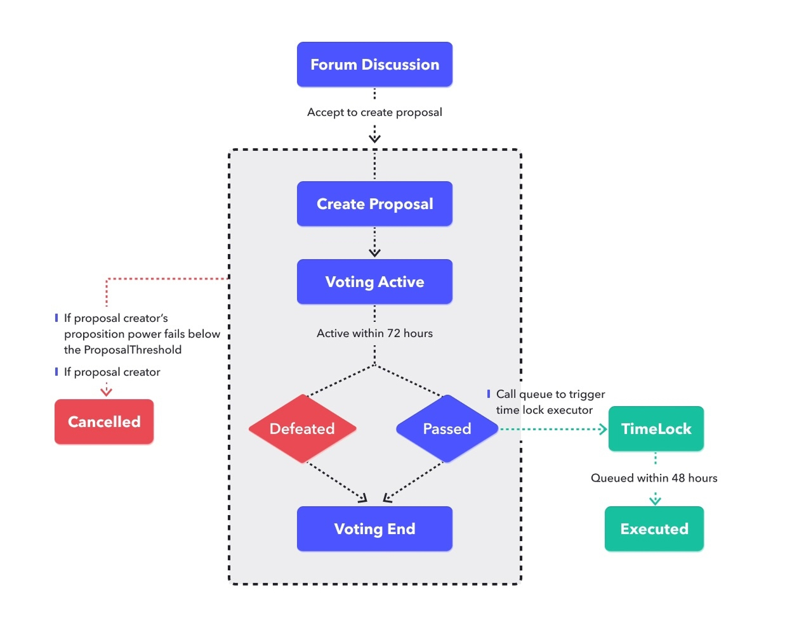

# JustLend Improvement Proposals

The JustLend DAO introduces a structured approach to decentralizing the JustLend protocol and empowering community autonomy. JustLend DAO fosters consensus among all participants in the JustLend ecosystem through governance mechanisms and economic incentives. The protocol's functions and the JST token serve as core security elements of the JustLend protocol.

Governance mechanisms in decentralized protocols are driven by participation, incentives, self-regulation, and policy management within the community, adapting to and coexisting with the market dynamics. JustLend DAO manages on-chain operations through proposals, enabling the protocol to achieve self-operation, self-governance, and self-evolution based on predefined rules through intelligent management and token economic incentives, without third-party intervention, ultimately maximizing efficiency and value transfer.

An essential incentive method in the governance process of JustLend DAO, JST tokenizes various organizational elements, integrating monetary capital, human capital, and other resources to enhance organizational efficiency significantly. The goal of the JST economy is to facilitate the virtuous and long-term development of the entire JustLend DAO ecosystem, allowing stakeholders and investors to benefit from a more secure agreement. JST holders are accountable for the protocol and ecosystem, contributing through practical actions such as technical integration (e.g., DeFi front-end integration) or financial investments (e.g., liquidity provision), significantly enhancing protocol execution, security, and functionality.

The JustLend DAO was established to facilitate the development and long-term governance of the JustLend DAO protocol. The goal is to create a future-proof governance framework leveraging system incentives and multi-level governance to maintain an effective balance that drives long-term growth and continuous protocol optimization.

### **Governance Process**

JustLend Protocol's governance relies on participants locking JST tokens to acquire voting power for JustLend Improvement Proposals (JIPs).  The governance is first discussed in the [JustLend DAO forum](https://forum.justlend.org/). If there is no contentious, then it is conducted through voting. Any users who hold more than 200 million JST can initiate a proposal on the platform, and other users can participate in the vote. If and only if the number of votes in favor of the proposal exceeds the number of negative votes and meanwhile exceeds 600 million, the proposal can be passed and implemented two days later.

JST tokens enable holders to collectively act as managers of the protocol, enabling them to vote and propose. The process of submitting a proposal and voting is as shown below (before entering the lock phase, you can cancel the created proposal at any time by proposal)

1. JST holders call governance contracts to create proposals. Once a proposal is successfully created, it will undergo a 2-day review period. Voting rights are then recorded, and the voting process begins after the review period ends.
2. JST holders receive votes and can choose to either support or oppose a proposal based on its content. Each JST holder is entitled to one vote. The voting period lasts for 3 days.
3. Once the voting period ends, the governance contract will determine whether the proposal has been approved based on the number of votes. If the proposal does not pass, it will be terminated. If the proposal is approved, it will trigger the time lock executor.
4. If the proposal is passed, the proposal will enter a lock-up period of 48 hours. After the lock-up period ends, the proposal will be in a pending state, and the proposal will take effect immediately after the execution.

Taken together, in general, a full proposal will take at least a week.
