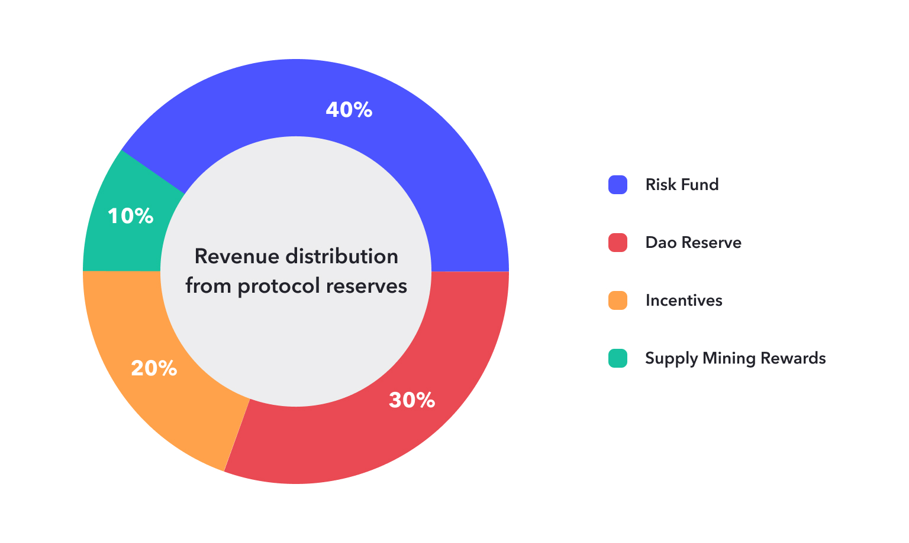

The term tokenomics encompasses a wide range of concepts that defines the science and behavior of blockchain economies. In simple terms, tokenomics are the financial foundation of blockchains. Each protocol has its unique economic model, and for the protocol's healthy and enduring development, the economic model should include design, distribution, and management of tokens, as well as the incentives and mechanisms that drive their value and utilization.

The JustLend tokenomics  is designed to promote a healthy, long term self-sustaining economy with participant incentives aligned to the security and decentralization of the network. The main participants in this economy are suppliers, borrowers and clients who stakes TRX or USDT. The protocol revenue from users will be used to optimize income distribution and cater to the protocol's present and future needs.

### **The JustLend DAO Economy**
JustLend DAO is a decentralized governance protocol, where users can participate in governance using the platform token JUST (Symbol: JST) to make decisions about the development of JustLend DAO.  The platform has integrated multiple independent DeFi protocols and plans to incorporate more to form the JustLend economy. There are four integrated protocols characterize the JustLend economy:

* **SBM (Supply and Borrow Market):**  A supply and borrow market protocol launched in December 2020.
* **sTRX (Staked TRX):**  A high-efficiency and yield TRON network staking pool launched in April 2023.
* **JustStable Coin (USDJ):** A stablecoin minting protocol launched in April 2020, which was the first application protocol of JST.
* **Energy Rental:** A platform for flexible and low-cost energy rental on the TRON network launched in April 2023, significantly reducing transaction costs.

#### SBM - Supply and Borrow Market
SBM is a TRON-powered money market protocol designed to create fund pools with interest rates determined by an algorithm based on the supply and demand of TRON assets. The protocol involves two key roles: suppliers and borrowers, who directly engage with the protocol to earn or pay a floating interest rate. SBM serves as the core protocol of JustLend DAO.

Within SBM, each money market corresponds to a unique TRON asset, such as TRX, TRC20 stablecoins (e.g., USDT), or other TRC20-based tokens. The protocol features an open and transparent ledger that records all transactions and historical interest rates.

#### Staked TRX
TRX holders have the opportunity to receive the receipt token sTRX by staking TRX, allowing them to earn double yields from voting and Energy rental. In contrast to participating in Stake 2.0, sTRX offers higher returns and can be utilized in DeFi applications, including decentralized exchanges (DEXs). This token eliminates liquidity constraints associated with the unstaking period in Stake 2.0.

#### JustStable Coin - USDJ
USDJ is a stablecoin native to the TRON network, generated through decentralized smart contracts. Users can stake TRX as collateral to create USDJ, which then circulates freely like any other cryptocurrency. USDJ is staked to the US dollar using Collateralized Debt Positions (CDPs) and features autonomous feedback mechanisms to maintain its stability.

#### Energy Rental
An innovative protocol for flexible and cost-effective energy rental on the TRON network. The energy obtained through this protocol is significantly cheaper than that obtained through burning or staking TRX, enabling the cost of most transactions to be reduced to below 1 TRX.

#### Supply Mining
The latest round of JustLend DAO deposit supply mining started on February 16, 2024, and has already completed 36 rounds. The mining activity is community-driven and funded by the subDAO of JustLend DAO - GrantsDAO, which empowers community developers, contributors, participants, and any projects that contribute to the ecosystem, while providing positive incentives to ecosystem participants.

#### Buyback & Burning
The JST ecosystem burn plan implemented by GrantsDAO aims to use protocol base income and donations from partner projects to provide liquidity to SunSwap V2 for JST trading pairs and burn the resulting liquidity tokens (e.g., [SUNSWAP-JST-TRX V2 Token](https://tronscan.org/#/token20/TUDo1PuMG6j4aDSg6rsCNiz5gR5cnQaNTT)), thus accumulating JST liquidity in DEX. Compared to directly burning tokens, the ecosystem burn plan's approach reduces supply while maintaining liquidity in DEX, stabilizing the price of JST.

### **Revenue Distribution from Protocol Reserves**
The protocol reserves mainly consist of accumulated borrow fees. The revenue allocation model divides income from these reserves into four key segments:

* **Risk Fund(40%):** This fund is set up to mitigate potential deficiencies in the protocol, especially during instances of ineffective or delayed liquidations. The allocation to the risk fund remains constant to uphold a robust financial buffer;
* **DAO Reserve(30%):** The reserve strengthens the protocol's resilience and serves as a robust safety net for its continuous operations;
* **Incentives(20%):** This part is emmitted as incentives for suppliers and borrowers;
* **Supply Mining Rewards(10%):** This rewards utilized a portion of the reserve revenue to incentivize  developers, contributors, participants, and any projects that contribute to the ecosystem.

